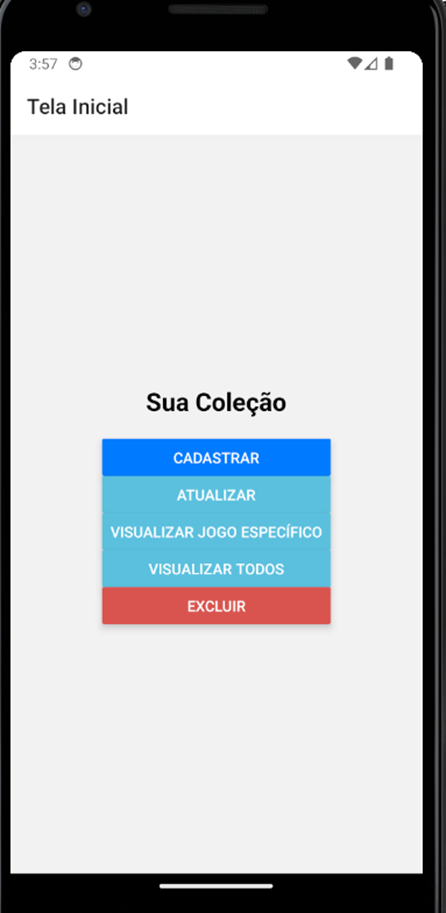
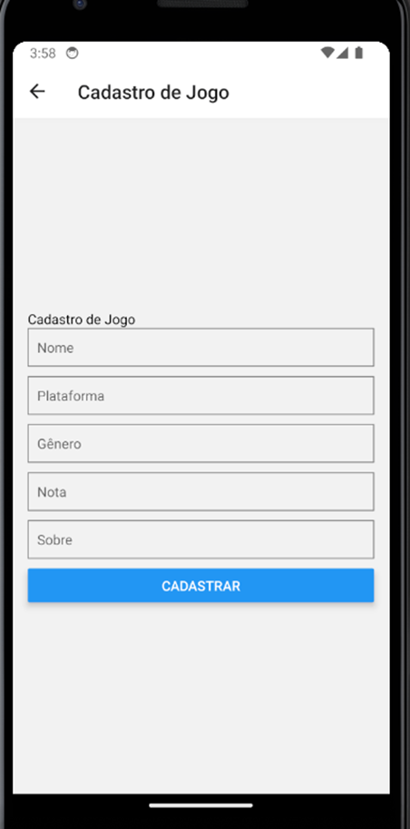
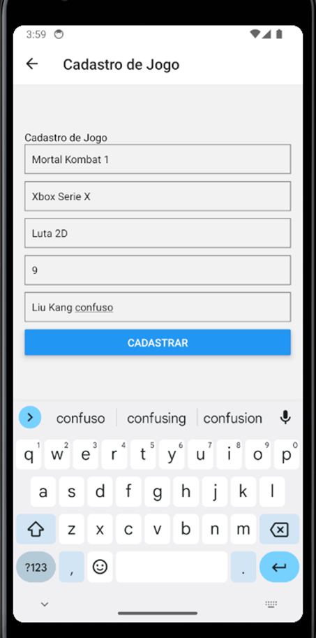
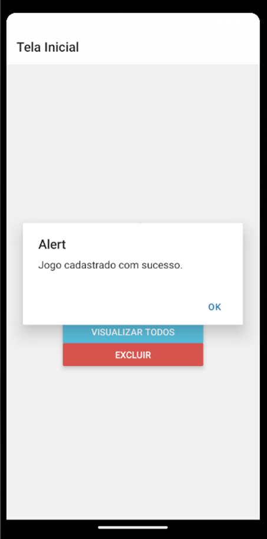
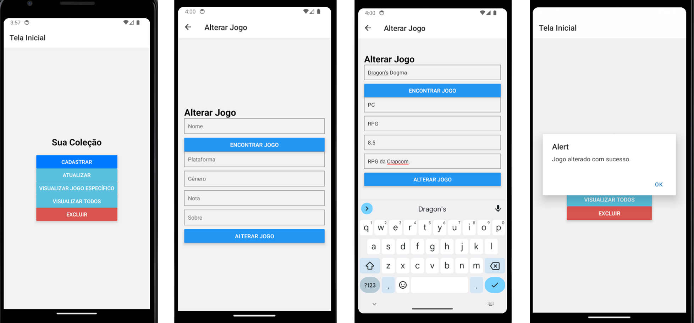
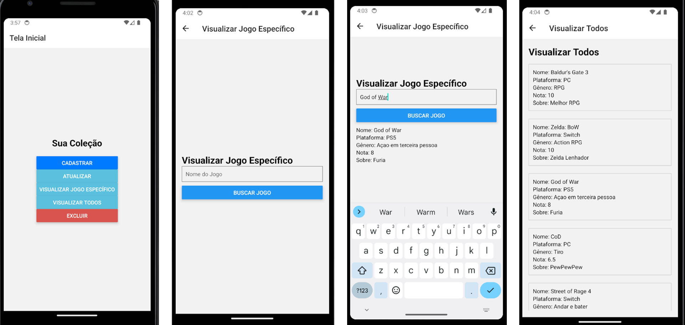
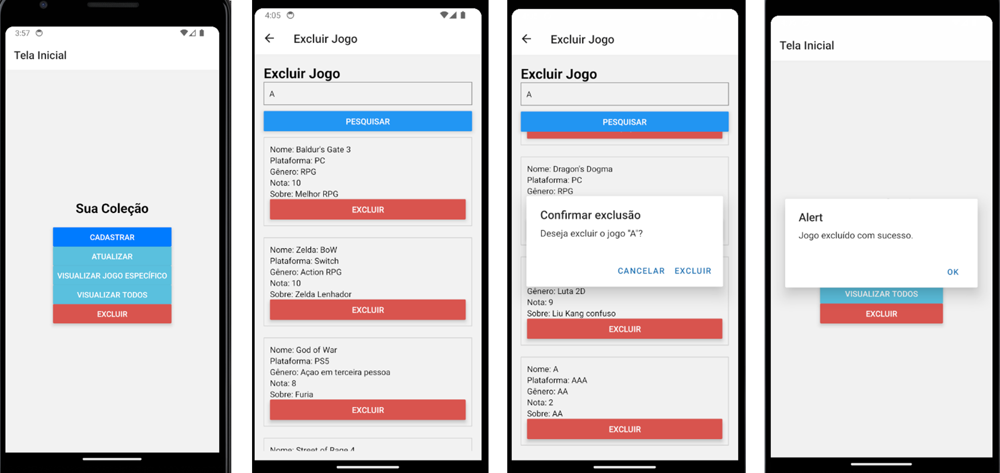

## Exemplos anti copia 🕵️‍♂️
# Cadastro de jogos

<p>Este é um exemplo simples de uma aplicação REACT NATIVE para gerenciamento de jogos. O objetivo deste projeto é demonstrar como criar, ler, atualizar e deletar (CRUD) jogos em uma aplicação android.<b><u>Ele contém propositalmente algumas falhas e áreas de melhoria, incentivando os alunos a corrigir e aprimorar o código, para seu projeto de extensão e não apenas copie.</b></u></p>

## Funcionalidades

- Listar todos os jogos
- Adicionar um novo jogo
- Editar um jogo existente
- Listar um jogo especifico
- Excluir um jogo

## Tecnologias Utilizadas

- React Native
- Expo
- Sqlite
- React navigation

## Estrutura do Projeto - Apenas o que foi modificado
```
controlejogos/
├── database/
│   └── baseDados.js
├── navigation/
│   └── AppNavigator.js
├── screens/
│   └── AlterarJogoScreen.js
│   └── CadastraoScreen.js
│   └── ExcluirJogoScreen.js
│   └── HomeScreen.js
│   └── VisualizarJogoEspecificoScreen.js
│   └── VisualizartodosScreen.js
└── App.js
├── .gitignore
└── README.md
```

## Executando a Aplicação
1. Clone o repositório para a sua máquina local.
&
```
npm install
```

## Telas exemplo:













